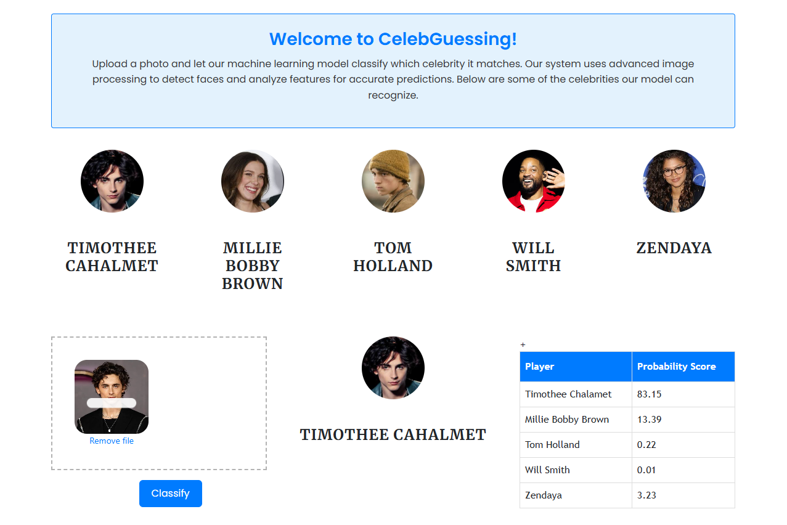

# 🧠 Celebrity Classification using Machine Learning

### An end-to-end machine learning project for recognizing famous acting personalities.

This project focuses on building an **image classification model** that can recognize and classify well-known **actors and actresses** using machine learning techniques.

---

## 🏅 Personalities Covered

The model is trained to identify the following five actors:

- **Timothee Chalamet**
- **Millie Bobby Brown**
- **Tom Holland**
- **Will Smith**
- **Zendaya**

---

## 📁 Project Structure

- **UI** – Frontend website code  
- **server** – Python Flask backend  
- **model** – Jupyter notebook for model building  
- **images_dataset** – Dataset used for training  

---

## ⚙️ Technologies and Tools Used

- **Python** – Core development language  
- **NumPy**, **OpenCV** – Data preprocessing and image cleaning  
- **Matplotlib**, **Seaborn** – Visualization and analysis  
- **Scikit-learn (sklearn)** – Model training and evaluation  
- **Flask** – Backend server for deployment  
- **HTML**, **CSS**, **JavaScript** – Web UI  
- **Jupyter Notebook**, **VS Code**, **PyCharm** – IDEs used in development  

---

## 🚀 How It Works

1. **Image Collection** – Images of the five actors are gathered using Google Image Scraping scripts.  
2. **Data Preprocessing** – Images are cleaned, resized, and processed with OpenCV and NumPy.  
3. **Model Training** – A machine learning model is trained using Scikit-learn.  
4. **Model Deployment** – The trained model is deployed via Flask.  
5. **User Interface** – A web-based UI lets users upload images and receive predictions in real time.

---

## 💡 Key Features

- Complete ML pipeline: data collection → training → deployment  
- Image-based celebrity classification  
- Fully integrated web application  
- Lightweight and easy to extend for learning or prototyping  

---

## 🧩 Future Improvements

- Switch to deep learning (CNNs) with TensorFlow or PyTorch  
- Expand dataset size for better accuracy  
- Add more acting personalities  
- Improve UI experience and feedback  

---

## 📚 Author

Developed as a hands-on **Data Science and Machine Learning** project demonstrating how image classification can be integrated with a Flask-powered web interface for real-world use.
